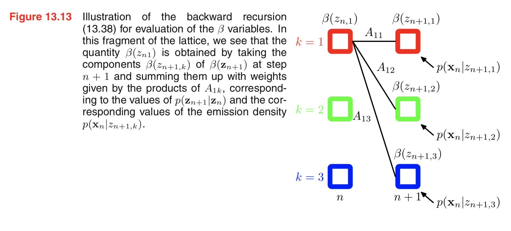

====================================
Hidden Markov Models
====================================
A summary of Chapter 13 Sequential Data of *Pattern Recognition and Machine Learning - Springer 2006*.

.. contents::

----------------------------------
Markov Models
----------------------------------

Using the product rule, we can express the joint distribution for a sequence of obervations in the form:

.. math::

    p(x_1, ..., x_N) &= \prod\limits_{n=1}^N p(x_1, ... x_{n-1})\\
                     &= p(x_1) p(x_2|x_1) p(x_3|x_2, x_1) ...

First-order Markov chain
----------------------------------

- **Definition:** First-Order Markov Chain
    If we assume that each of the conditional distributions on the RHS is independent of all previousobservations except the most recent (the Markov Property), we obtain the *first-order Markov chain*:

.. math::

    p(x_1, ..., x_N) &= p(x_1)\prod\limits_{n=2}^N p(x_n|x_{n-1})\\
                     &= p(x_1) p(x_2|x_1) p(x_3|x_2) ...

.. topic:: Illustration of First-Order Markov Chain

    .. figure:: _static/hidden_markov_models/first_order_markov_chain.png                     

The conditional distribution for observation :math:`x_n`, given all of the observations up to time :math:`n` is given by:

.. math::

    p(x_n | x_1, ..., x_{n-1}) = p(x_n|x_{n-1})

If we use this model to predict the next observation in a sequence, the distribution of predictions will only depend on the value of the immediately preceding observation, and will be independent of all earlier observations.

- **Definiton:** Homogeneous Markov Chain
    A markov chain is *homogeneous* when we assume a stationary time series, i.e. conditional distributions :math:`p(x_n|x_{n-1})` are equal. 

Higher-order Markov chain
----------------------------------
Sometimes the trends in the data over several successive observations will provide important information in predicting the next value. We can increase the number of obeservations the predictions depend on and obtain higher-order Markov chains.

For example, the joint distribution of the second-order Markov chain is given by:

.. math::

        p(x_1, ..., x_N) &= p(x_1)p(x_2|x_1)\prod\limits_{n=3}^N p(x_n|x_{n-1}, x_{n-2})\\
                     &= p(x_1) p(x_2|x_1) p(x_3|x_2, x_1) p(x_4|x_3, x_2) ...

.. topic:: Illustration of Second-Order Markov Chain

    .. figure:: _static/hidden_markov_models/second_order_markov_chain.png

More generally, we have :math:`M^{th}`-order markov chain where

.. math::

    p(x_n |x_1, ... x_{n-1}) = p(x_n| x_{n-1}, ... x_{n-M})

- *Note* the incresed flexibility results in a model with a much larger number of parameters (can grow exponentially).

Latent variables
----------------------------------
Suppose we do not want to limit our model to the Markov assumption and yet can be specified using a limited number of free parameters, we can introduce *latent variables* to permit a rich class of models to be constructed out of simple components. (Similar approach: mixture distributions, continuous latent variable models, etc.)

- **Definition** State Space Model
    For each observation :math:`x_n`, we introduce a corresponding latent variable :math:`z_n` (can have different dimentionality/type). If we assume that the latent variables form a Markov chain, we have a graphical structure called *state space model*. 

.. topic:: State Space Model

    .. _figure_13.5:
    .. figure:: _static/hidden_markov_models/markov_chain_latent.png

It satisfies the key conditional independence property that :math:`z_{n-1}` and :math:`z_{n+1}` are **independent** given :math:`z_n`, and the joint distribution of the model is given by:

.. math::
    :label: equ1

    p(x_1, ..., x_N, z_1, ... z_N) &= p(z_1) (\prod\limits_{n=2}^N p(z_n|z_{n-1})) (\prod\limits_{n=1}^N p(x_n|z_n))\\
                                   &= p(z_1)p(z_2|z_1)p(z_3|z_2)...p(x_1|z_1)p(x_2|z_2)p(x_3|z_3)...
    

Using the d-separation criterion, we see that there is always a path connecting any two observed variables :math:`x_n` and :math:`x_m` voa tje ;atemt variables, and that this path is never blocked.

In this model, the predictions for :math:`x_{n+1}` depends on all previous observations, because :math:`p(x_{n+1}|x_1, ..., x_n)` does not exhibit any conditional independence properties.

.. admonition:: TODO

    d-separation

There are two models described by this graph:

    1. *Hidden Markov model* if the latent variables are discrete;
    2. *Linear dynamical system* if both the latent and the observed variables are Gaussian.

*Note:* the observed variables in an HMM may be discrete or continuous, and a variety of different conditional distributions can be used to model them.

----------------------------------
Hidden Markov Models
----------------------------------
The hidden Markov model is a specific instance of the state space model in which the latent variables are discrete. If we examine a single time slice of the model, we see that it corresponds to a mixture distribution, with component densities given by :math:`p(\mathbf{x}|\mathbf{z})`.

.. admonition:: TODO

    Mixture model

The discrete multinomial variables :math:`\mathbf{z}_n` represent the latent variables, and :math:`\mathbf{x}_n` the corresponding observation. We use a 1-of-K coding scheme.

Specification - Transition probabilities, matrix and diagram
--------------------------------------------------------------

The latent variable :math:`\mathbf{z}_n` depends on the previous latent ariable :math:`\mathbf{z}_{n-1}`, and the conditional distribution :math:`p (\mathbf{z}_n|\mathbf{z}_{n-1})` is stored in the matrix :math:`\mathbf{A}`. The elements of :math:`\mathbf{A}` are referred to as **transition probabilities**:

.. math::

    A_{jk} := p(z_k^n = 1|z^{n-1}_j = 1), \\

where

.. math::

    0 \leq A_{jk} &\leq 1\\
    \sum_k A_{jk} &= 1

*Note:* 
    - :math:`A_{jk}` is the probabitliy of the latent variable transiting from state j to state k.
    - :math:`\mathbf{A}` has :math:`K(K-1)` independent parameters (-1 because the probabilities sum to one) 

The conditional distribution can then be explicitly written as:

.. math::

    p (\mathbf{z}_n|\mathbf{z}_{n-1}, \mathbf{A}) = \prod\limits_{k=1}^K \prod\limits_{j=1}^K A_{jk}^{z^{n-1}_j z^n_k}

The initial latent node :math:`\mathbf{z_1}` has a marginal distribution :math:`p(\mathbf{z_1})` represented by a vector of probabilities :math:`\mathbf{\pi}` with :math:`\pi_k := p(z^1_k = 1)`, so that

.. math::

    p(\mathbf{z_1}|\mathbf{\pi}) = \prod\limits_{k=1}^K \pi_k^{z_k^1},

where :math:`\sum_k \pi_k = 1`.

If we unfold a state transition diagram over time, we have an alternative representation of the transitions, known as *lattive* or *trellis* diagram.

.. topic:: Example of Transition Diagram 

    .. figure:: _static/hidden_markov_models/transition_diagram_1.png    

    .. figure:: _static/hidden_markov_models/transition_diagram_2.png     

Specification - Emission probabilities
------------------------------------------------
We now define the conditional distributions of the observed variables :math:`p(\mathbf{x}_n | \mathbf{z}_n, \mathbf{\phi})`, where :math:`\mathbf{\phi}` is a set of parameters governing the distribution. 

These emission probabilities can be given by:

    1. Gaussians if the elements of :math:`\mathbf{x}` are coninuous variables,
    2. or conditional probability tables if :math:`\mathbf{x}` is discrete.

Because :math:`\mathbf{x}_n` is observed, given :math:`\mathbf{\phi}`, :math:`p(\mathbf{x}_n | \mathbf{z}_n, \mathbf{\phi})` consists of a vector of K numbers, corresponding to the K possible states of the binary vector :math:`\mathbf{z}_n`:

.. math::

    p(\mathbf{x}_n | \mathbf{z}_n, \mathbf{\phi}) = \prod\limits_{k=1}^K p(\mathbf{x}_n | \mathbf{\phi})^{z^n_k}.

*Note:*

    - We will assume a *homogeneous* model, where the parameters :math:`\mathbf{A}` and :math:`\mathbf{\phi}` are shared.

    - A mixture model for an i.i.d. data set corresponds to the case where :math:`A_{jk}` are the same for all j. The conditional distribution :math:`p(\mathbf{z}_n | \mathbf{z}_{n-1})` is independent of :math:`\mathbf{z}_{n-1}`.
        - corresponds to deleting the horizontal links in :numref:`figure_13.5`.

Specification - Joint probability
------------------------------------------------
The joint probability distribution over both latent and observed variables is given by:

.. math::
    :label: equ_joint_prob
    
    p(\mathbf{X}, \mathbf{Z} | \mathbf{\theta}) = p(\mathbf{z_1}|\mathbf{\pi}) \Big[ \prod\limits_{n=2}^N p(\mathbf{z}_n|\mathbf{z}_{n-1}, \mathbf{A} ) \Big]  \prod\limits_{m=1}^N p(\mathbf{x}_m|\mathbf{z}_m, \mathbf{\phi}),

where :math:`\mathbf{X} = \{ \mathbf{x}_1, ...,  \mathbf{x}_N \}`, :math:`\mathbf{Z} = \{ \mathbf{z}_1, ...,  \mathbf{z}_N \}`, and :math:`\mathbf{\theta} = \{ \mathbf{\pi}, \mathbf{A}, \mathbf{\phi}\}` is the set of parameters.

*Note:* more general form: :eq:`equ1`

Expectation-Maximization algorithm
------------------------------------------------
If we have observed a dataset :math:`\mathbf{X} = {\mathbf{x_1}, ... \mathbf{x_N}}`, we can determine the parameters of the HMM model using maximum likelihood. The likelihood function is:

.. math::

    p(\mathbf{X}|\mathbf{\theta}) = \sum\limits_\mathbf{Z}  p(\mathbf{X}, \mathbf{Z} | \mathbf{\theta}),

where we marginalize over the latent variables in :eq:`equ_joint_prob`.

We use the **expectation maximization algorithm** to maximize the likelihood function efficiently. The EM algorithm starts with some initial selection for the model parameters, denoted as :math:`\mathbf{\theta}^{old}`.

The E step
***********

- First find the posterior distribution of the latent variables :math:`p (\mathbf{Z} | \mathbf{X}, \mathbf{\theta}^{old})`.

- Then we evaluate the expectation of the logarithm of the complete-data likelihood function:

.. math::
    :label: equ_expect_likelihood

    Q(\mathbf{\theta}, \mathbf{\theta}^{old}) = \sum\limits_\mathbf{z} p (\mathbf{Z} | \mathbf{X}, \mathbf{\theta}^{old}) \text{ln} p(\mathbf{X}, \mathbf{Z} | \mathbf{\theta}).

.. topic:: Quantities to evaluate

    We introduce some new notations for convenience.

        - the marginal posterior distribution of a latent variable :math:`\mathbf{z}_n`:

        .. math::

            \gamma(\mathbf{z}_n) = p(\mathbf{z}_n| \mathbf{X}, \mathbf{\theta}^{old})

        - the joint posterior distribution of two successive latent variables:

        .. math::

            \xi(\mathbf{z}_{n-1}, \mathbf{z}_n) = p(\mathbf{z}_{n-1}, \mathbf{z}_n | \mathbf{X}, \mathbf{\theta}^{old}).

For each value of :math:`n`, we store 
    - :math:`\gamma(\mathbf{z}_n)` using a set of K nonnegative numbers (sum to 1)
    - :math:`\xi(\mathbf{z}_{n-1}, \mathbf{z}_n) ` using a :math:`K\times K` matrix of nonnegative numbers (sum to 1)

**The goal of the E step is to evaluate these quantities efficiently.** See details in later sections.

We use :math:`\gamma(z_k^n)` to denote the conditional probability of :math:`z^n_k = 1` and similar for :math:`\xi(z^{n-1}_j, z^n_k)`. We have the following equations:

.. math::

    \gamma(z^n_{k}) &= p(z^n_{k} = 1| \mathbf{X}, \mathbf{\theta}^{old})\\
                    &= \mathbb{E}[z^n_{k}] = \sum_\mathbf{z}\gamma(\mathbf{z}) z^n_{k}\\
    \xi(z^{n-1}_{j}, z^n_k) &= p(z^{n-1}_{j} = 1 , z^n_k = 1| \mathbf{X}, \mathbf{\theta}^{old})\\
                    &= \mathbb{E}[z^{n-1}_{j}z^n_k] = \sum_\mathbf{z}\gamma(\mathbf{z}) z^{n-1}_{j}z^n_k.

Now we substitute :eq:`equ_joint_prob` into :eq:`equ_expect_likelihood`, and use the above notations, we have:

.. math::
    :label: equ_expect_likelihood_2

     Q(\mathbf{\theta}, \mathbf{\theta}^{old}) 
     &= \sum\limits_\mathbf{z} p (\mathbf{Z} | \mathbf{X}, \mathbf{\theta}^{old}) \text{ln} 
     \Big[ p(\mathbf{z_1}|\mathbf{\pi}) \big[ \prod\limits_{n=2}^N p(\mathbf{z}_n|\mathbf{z}_{n-1}, \mathbf{A} ) \big]  \prod\limits_{m=1}^N p(\mathbf{x}_m|\mathbf{z}_m, \mathbf{\phi}) \Big]\\
     &= \sum\limits_{k=1}^K  \gamma(z^1_{k}) \text{ln} \pi_k + \sum\limits_{n=2}^K \sum\limits_{j=1}^K \sum\limits_{k=1}^K \xi(z^{n-1}_{j}, z^n_k) \text{ln} A_{jk} + \sum\limits_{n=1}^N \sum\limits_{k=1}^K \gamma(z^n_{k}) \text{ln} p(\mathbf{x}_n |\phi_k).

The M step
************
In the M step, we maximize :math:`Q(\mathbf{\theta}, \mathbf{\theta}^{old})` with respect to the parameters :math:`\mathbf{\theta} = \{ \mathbf{\pi}, \mathbf{A}, \mathbf{\phi}\}`, where we treat :math:`\gamma(\mathbf{z}_n)` and :math:`\xi(\mathbf{z}_{n-1}, \mathbf{z}_n)` as constant.

.. topic:: Parameters Updates
    
    Using appropriate Lagrange multipliers, we get the optimal values of :math:`\pi` and :math:`\mathbf{A}`:

    .. math::
        \pi_k &= \frac{\gamma(z_k^1)}{\sum\limits_{j=1}^K \gamma(z^1_j)}\\
        A_{jk} &= \frac{\sum\limits_{n=2}^N \xi(z^{n-1}_j, z^n_k)}{\sum\limits_{l=1}^K\sum\limits_{n=2}^N \xi(z^{n-1}_j, z^n_l)}

*Note:* if any element of :math:`\pi` and :math:`\mathbf{A}` are set to zero initially, it will remain zero in subsequent EM updates.

For maximizing :math:`Q(\mathbf{\theta}, \mathbf{\theta}^{old})` with respect to :math:`\mathbf{\phi}_k`, we notice that only the final term in :eq:`equ_expect_likelihood_2` depends on :math:`\mathbf{\phi}_k`. The calculations depend on the emission densities we choose.

.. topic:: Parameters Updates

    Suppose we have Gaussian emission densities :math:`p(\mathbf{x}_n |\phi_k) = \mathcal{N}(\mathbf{x}| \mathbf{\mu}_k, \mathbf{\Sigma}_k)`:

    .. math::

        \mathbf{\mu}_k &= \frac{\sum\limits_{n=1}^N \gamma(z_k^n)\mathbf{x}_n}{\sum\limits_{n=1}^N  \gamma(z^n_k)}\\
        \mathbf{\Sigma}_k &= \frac{\sum\limits_{n=1}^N \gamma(z_k^n)(\mathbf{x}_n - \mathbf{\mu}_n)(\mathbf{x}_n - \mathbf{\mu}_n)^T }{\sum\limits_{n=1}^N  \gamma(z^n_k)}\\

    Suppose we have discrete multinomial observed variables, where

    .. math::

        p(\mathbf{x}|\mathbf{z}) = \prod\limits^D_{i=1}\prod\limits^K_{k=1} \mu_{ik}^{x_iz_k}

    then the M-step equations are:

    .. math::

        \mu_{ik} &= \frac{\sum\limits_{n=1}^N \gamma(z_k^n)x^n_i}{\sum\limits_{n=1}^N \gamma(z^n_k)}\\

The forward-backward algorithm
------------------------------------------------
For the E step of the EM algorithm, we want to find a efficient way to evaluate :math:`\gamma(\mathbf{z}_n)` and :math:`\xi(\mathbf{z}_{n-1}, \mathbf{z}_n)`. The posterior distribution of the latent variables can be obtained efficiently using a two-stage message passing algorithm. In this context, it is the *forward-backward algotirhm*, or the *Baum-Welch algorithm*.

From now on, we will emit the dependence on the model parameter :math:`\theta^{old}` as they are fixed.

Let's start with :math:`\gamma(\mathbf{z}_n)`. Using Bayes' theorem and conditional independence property, we have:

.. math::
    :label: equ_forward_backward
    
    \gamma(\mathbf{z}_n) &= p(\mathbf{z}|\mathbf{X}) = \frac{p(\mathbf{X}|\mathbf{z}_n)p(\mathbf{z}_n)}{p(\mathbf{X})} \\
    &= \frac{p(\mathbf{x}_1, ..., \mathbf{x}_n, \mathbf{z}_n)p(\mathbf{x}_{n+1}, ..., \mathbf{N}|\mathbf{z}_n)}{p(\mathbf{x}_N)} \\
    &= \frac{\alpha(\mathbf{z}_n)\beta(\mathbf{z}_n)}{p(\mathbf{X})},

where we define

.. math::

    \alpha(\mathbf{z}_n) &:= p(\mathbf{x}_1, ..., \mathbf{x}_n, \mathbf{z}_n)\\
    \beta(\mathbf{z}_n) &:= p(\mathbf{x}_{n+1}, ..., \mathbf{x}_N|\mathbf{z}_n)

*Note:*  Given :math:`\mathbf{X} = \{\mathbf{x}_1, ..., \mathbf{x}_N \}`, every path from any one of the nodes :math:`\mathbf{x}_1, ... \mathbf{x}_{n-1}` to the node :math:`\mathbf{x}_n` passes through the node :math:`\mathbf{z}_n`, which is observed. All such path are head-to-tail. Check topics on *Graphical Models* for proving conditional independence properties.

.. topic:: Forward Recursion for :math:`\alpha(\mathbf{z}_n)` 

    We can evaluate :math:`\alpha(\mathbf{z}_n)` recursively in the forward direction:

    .. math::
    
        \alpha(\mathbf{z}_n) := p(\mathbf{x}_n|\mathbf{z}_n)\sum\limits_{\mathbf{z}_{n-1}}\alpha(\mathbf{z}_{n-1})p(\mathbf{z}_n|\mathbf{z}_{n-1}).

    *Note:* There are K terms in the summation for each of the K values of :math:`\mathbf{z}_n`, which gives a cost of :math:`O(K^2)`. The overall cost of evaluating the whole chain is of :math:`O(K^2N)`.

    The initial condition is given by:

    .. math::

        \alpha(\mathbf{z}_1) := p(\mathbf{x}_1, \mathbf{z}_1) = p(\mathbf{z}_1)p(\mathbf{x}_1|\mathbf{z}_1) = \prod\limits_{k=1}^K(\pi_k p(\mathbf{x}_1|\mathbf{\phi}_k))^{z_k^1},

    which means that for :math:`k = 1, ... K`,

    .. math::

        \alpha(z^1_k) = \pi_k p(\mathbf{x}_1|\mathbf{\phi}_k).

.. figure:: _static/hidden_markov_models/forward.png     

.. topic :: Backward Resursion for :math:`\beta(\mathbf{z}_n)`

    Similarly we can find the recursive relation for :math:`\beta(\mathbf{z}_n)`. In this case, we have a backward message passing algorithm that evaluate :math:`\beta(\mathbf{z}_n)` in terms of :math:`\beta(\mathbf{z}_{n+1})`.

    .. math::

        \beta(\mathbf{z}_n) &:= \beta(\mathbf{z}_{n+1})p(\mathbf{x}_{n+1}|\mathbf{z}_{n+1})p(\mathbf{z}_{n+1}|\mathbf{z}_{n})\\

    To obtain the initial value, we set :math:`n = N` in :eq:`equ_forward_backward` and get:

    .. math::

        p(\mathbf{z}_N|\mathbf{X}) = \frac{p(\mathbf{X}, \mathbf{z}_N)\beta(\mathbf{z}_N)}{p(X)}.

    which is correct if we take :math:`\beta(\mathbf{z}_N) = 1` for all settings of :math:`\mathbf{z}_N`.

It is useful to monitor the likelihood function :math:`p(\mathbf{X})` during the EM optimization. From :eq:`equ_forward_backward`, we have:

.. math:: 
    
    p(\mathbf{X}) &= \sum\limits_{\mathbf{z}_n} \alpha(\mathbf{z}_n)\beta(\mathbf{z}_n) \\
                &=  \sum\limits_{\mathbf{z}_N} \alpha(\mathbf{z}_N).

Now consider :math:`\xi(\mathbf{z}_{n-1}, \mathbf{z}_n)`, which correspond to the value of the conditional probablities :math:`p(\mathbf{z}_{n-1}, \mathbf{z}_n| \mathbf{X})` for each of the :math:`K\times K` settings for :math:`(\mathbf{z}_{n-1}, \mathbf{z}_n)`. Use Bayes' theorem, we have:

.. math::
    :label: equ_forward_backward_2

    \xi(\mathbf{z}_{n-1}, \mathbf{z}_n) &= p(\mathbf{z}_{n-1}, \mathbf{z}_n| \mathbf{X}) \\
    &= \frac{\alpha(\mathbf{z}_{n-1})p(\mathbf{x}_{n}|\mathbf{z}_n)p(\mathbf{z}_{n}| \mathbf{z}_{n-1})\beta(\mathbf{z}_n)}{p(\mathbf{X})} 

.. admonition:: TODO

    Add a summary for the EM algorithm.